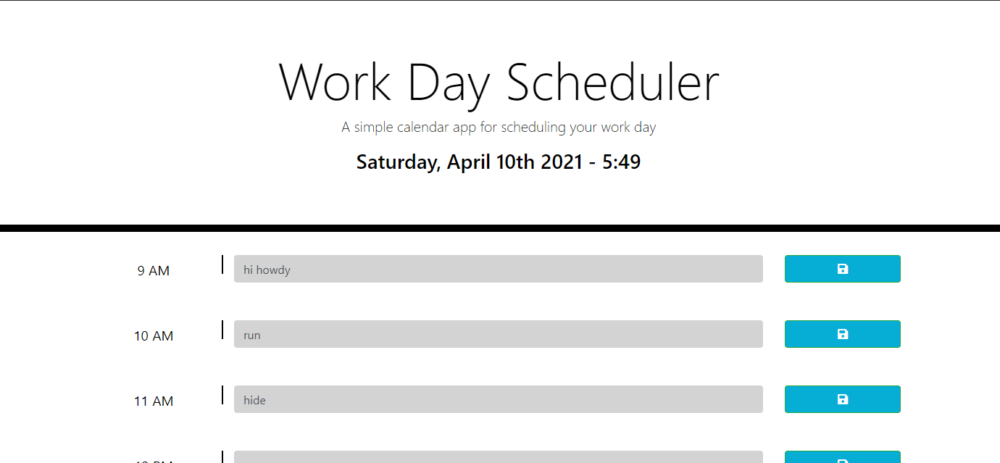
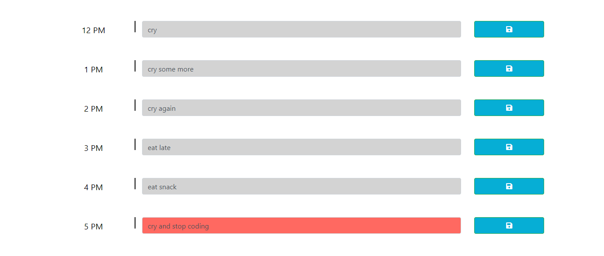

# Single-Day-Planner

## About the quiz:

The purpose of this was to create a single-day day-planner, that runs in a browser. The application will also keep track of information entered, in local storage, as well as the current local time. 

1. Present user with local date and time
2. Present user with a work day time frame 9am-5pm
3. Selecting input box allows user to input task
4. Input box with vary in color and iterate as time progresses
5. Clicking the save button will save input to local storage
6. When user refreshes the page, if saved, input will still be visible
7. As the day/time progresses the current time will be highlighted in red
8. User can delete and resave for the inputs as needed

## Built With:

* Javascript
* jQuery
* Moment.js
* HTML
* CSS
* Bootstrap

## Use:

User can schedule a busy day on a browser based daily planner, managing time by viewing the color coded list.

*Also used to learn, practice, test, and implement various jQuery and JavaScript library tools: 
* moment.js time/date formats
* Date prototype and getHours method
* data attributes
* modulus and ternary operator
* create various elements with jQuery
* string interpolation
* local storage items/info

## Contact:

* https://github.com/kitclong/Single-Day-Planner
* https://kitclong.github.io/Single-Day-Planner/

## Acknowledgments:

* moment.js Docs
* MDN Web Docs
* jQuery API Docs
* Stackoverflow
* getbootstrap
* w3schools
* Additional tutoring services
* Trilogy Education services
